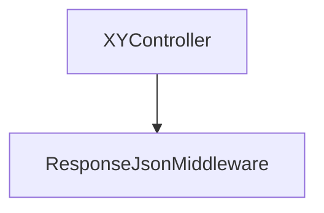
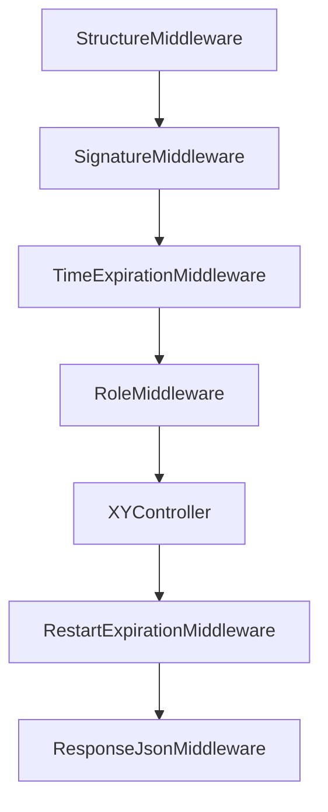

# UMApi - documentation

  The goal of this Api is to create a user-management system that will, as it's name suggests, manage user accounts of <b>"<i>xy</i>"</b> system (<i>the "xy" system is any system that needs management og user accounts</i>) and accelarate project development. Instead of building a user-management system from scratch i would just copy/paste this code in "xy" project and continue the development of other functionalities that are specific for that project.

 

- [Navigation](#navigation)
  - [Controllers](#controllers)
  - [Middlewares](#middlewares)
  - [Libraries](#libraries)
  - [Installation](#installation)

Api contains following controllers:

<ul>
  <li>RoleController</li>
  <li>UserController</li>
  <li>AuthController</li>
</ul>

|        Controller         |               Method               | Description |
|:-------------------:|:---------------------------------------:|:--------|
| `RoleController` | getAll  |    Get all available roles (<i>because the api uses soft delete, when retrieveing data we check if role was meant to be deleted</i>).     |
| `RoleController` | getById |    Retrieve the role given the ID.     |
| `RoleController` | create  |    Create a new role (<i>every <b>active</b> role needs to have a unique name</i>).     |
| `RoleController` | update  |    Update name of a role.     |
| `RoleController` | delete  |    Soft delete a role given an id.     |
| `UserController` | getAll  |    Get all available users.     |
| `UserController` | getById |    Retrieve the user given the ID.     |
| `UserController` | create  |    Create a new user.     |
| `UserController` | update  |    Update data of a user.    |
| `UserController` | delete  |    Soft delete a user given an id.    |
| `AuthController` | login   |    Create a refresh token if the credentials are valid.    |

## Middlewares

Execution order (<i>unprotected resource</i>):

> [!NOTE]
> The XYController represents placeholder data.

Execution order (<i>protected resource</i>):

> [!IMPORTANT]
> The diagram provided illustrates the sequence of middleware execution when the user is logged in. If a resource is public, the user request will only traverse through the ResponseJsonMiddleware.

## Libraries

  I have used following dependencies:

|        Name         |               Version               | Required |
|:-------------------:|:---------------------------------------:|:--------:|
|       `slim/slim`        | 4.12 |    ✅     |
|       `slim/psr7`        | 1.6 |    ✅     |
|   `illuminate/database`   |  10.45  |    ✅     |
|   `symfony/validator`   |        7.0        |    ✅     |
|   `php-di/php-di`   |          7.0         |    ✅     |
|   `vlucas/valitron`   |          1.4          |    ✅     |
| `predis/predis` |          2.2          |    ✅     |
| `phpunit/phpunit` |        11.0       |    ❌ - dev dependency     |

## Installation

9a8d9s8a9d8a9asdaoisdoaisdoaosdiao1293890109s8d9a8d9s8a9d8a9asdaoisdoaisdoaosdiao1293890109s8d9a8d9s8a9d8a9asdaoisdoaisdoaosdiao1293890109s8d9a8d9s8a9d8a9asdaoisdoaisdoaosdiao1293890109s8d9a8d9s8a9d8a9asdaoisdoaisdoaosdiao1293890109s8d9a8d9s8a9d8a9asdaoisdoaisdoaosdiao1293890109s8d9a8d9s8a9d8a9asdaoisdoaisdoaosdiao1293890109s8d9a8d9s8a9d8a9asdaoisdoaisdoaosdiao1293890109s8d9a8d9s8a9d8a9asdaoisdoaisdoaosdiao1293890109s8d9a8d9s8a9d8a9asdaoisdoaisdoaosdiao1293890109s8d9a8d9s8a9d8a9asdaoisdoaisdoaosdiao1293890109s8d9a8d9s8a9d8a9asdaoisdoaisdoaosdiao1293890109s8d9a8d9s8a9d8a9asdaoisdoaisdoaosdiao1293890109s8d9a8d9s8a9d8a9asdaoisdoaisdoaosdiao1293890109s8d9a8d9s8a9d8a9asdaoisdoaisdoaosdiao1293890109s8d9a8d9s8a9d8a9asdaoisdoaisdoaosdiao1293890109s8d9a8d9s8a9d8a9asdaoisdoaisdoaosdiao1293890109s8d9a8d9s8a9d8a9asdaoisdoaisdoaosdiao1293890109s8d9a8d9s8a9d8a9asdaoisdoaisdoaosdiao1293890109s8d9a8d9s8a9d8a9.

9a8d9s8a9d8a9asdaoisdoaisdoaosdiao1293890109s8d9a8d9s8a9d8a9asdaoisdoaisdoaosdiao1293890109s8d9a8d9s8a9d8a9asdaoisdoaisdoaosdiao1293890109s8d9a8d9s8a9d8a9asdaoisdoaisdoaosdiao1293890109s8d9a8d9s8a9d8a9asdaoisdoaisdoaosdiao1293890109s8d9a8d9s8a9d8a9asdaoisdoaisdoaosdiao1293890109s8d9a8d9s8a9d8a9asdaoisdoaisdoaosdiao1293890109s8d9a8d9s8a9d8a9asdaoisdoaisdoaosdiao1293890109s8d9a8d9s8a9d8a9asdaoisdoaisdoaosdiao1293890109s8d9a8d9s8a9d8a9asdaoisdoaisdoaosdiao1293890109s8d9a8d9s8a9d8a9asdaoisdoaisdoaosdiao1293890109s8d9a8d9s8a9d8a9asdaoisdoaisdoaosdiao1293890109s8d9a8d9s8a9d8a9asdaoisdoaisdoaosdiao1293890109s8d9a8d9s8a9d8a9asdaoisdoaisdoaosdiao1293890109s8d9a8d9s8a9d8a9asdaoisdoaisdoaosdiao1293890109s8d9a8d9s8a9d8a9asdaoisdoaisdoaosdiao1293890109s8d9a8d9s8a9d8a9asdaoisdoaisdoaosdiao1293890109s8d9a8d9s8a9d8a9asdaoisdoaisdoaosdiao1293890109s8d9a8d9s8a9d8a9asdaoisdoaisdoaosdiao1293890109s8d9a8d9s8a9d8a9.

9a8d9s8a9d8a9asdaoisdoaisdoaosdiao1293890109s8d9a8d9s8a9d8a9asdaoisdoaisdoaosdiao1293890109s8d9a8d9s8a9d8a9asdaoisdoaisdoaosdiao1293890109s8d9a8d9s8a9d8a9asdaoisdoaisdoaosdiao1293890109s8d9a8d9s8a9d8a9asdaoisdoaisdoaosdiao1293890109s8d9a8d9s8a9d8a9asdaoisdoaisdoaosdiao1293890109s8d9a8d9s8a9d8a9asdaoisdoaisdoaosdiao1293890109s8d9a8d9s8a9d8a9asdaoisdoaisdoaosdiao1293890109s8d9a8d9s8a9d8a9asdaoisdoaisdoaosdiao1293890109s8d9a8d9s8a9d8a9asdaoisdoaisdoaosdiao1293890109s8d9a8d9s8a9d8a9asdaoisdoaisdoaosdiao1293890109s8d9a8d9s8a9d8a9asdaoisdoaisdoaosdiao1293890109s8d9a8d9s8a9d8a9asdaoisdoaisdoaosdiao1293890109s8d9a8d9s8a9d8a9asdaoisdoaisdoaosdiao1293890109s8d9a8d9s8a9d8a9asdaoisdoaisdoaosdiao1293890109s8d9a8d9s8a9d8a9asdaoisdoaisdoaosdiao1293890109s8d9a8d9s8a9d8a9asdaoisdoaisdoaosdiao1293890109s8d9a8d9s8a9d8a9asdaoisdoaisdoaosdiao1293890109s8d9a8d9s8a9d8a9asdaoisdoaisdoaosdiao1293890109s8d9a8d9s8a9d8a9.
