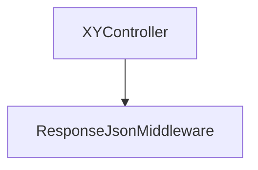
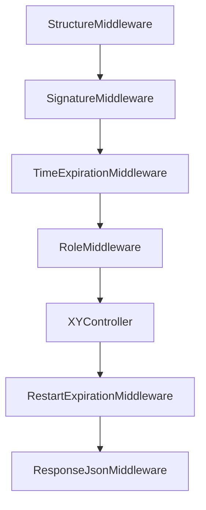

# UMApi - documentation

<p align="justify">
  The goal of this Api is to create a user-management system that will, as it's name suggests, manage user accounts of <b>"<i>xy</i>"</b> system (<i>the "xy" system is any system that needs management og user accounts</i>) and accelarate project development. Instead of building a user-management system from scratch i would just copy/paste this code in "xy" project and continue the development of other functionalities that are specific for that project.
</p> 

## Controllers

<p>Api contains following controllers:</p>
<ul>
  <li>RoleController</li>
  <li>UserController</li>
  <li>AuthController</li>
</ul>

<div align="center">

|        Controller         |               Method               | Description |
|:-------------------:|:---------------------------------------:|:--------|
| `RoleController` | getAll  |    Get all available roles (<i>because the api uses soft delete, when retrieveing data we check if role was meant to be deleted</i>).     |
| `RoleController` | getById |    Retrieve the role given the ID.     |
| `RoleController` | create  |    Create a new role (<i>every <b>active</b> role needs to have a unique name</i>).     |
| `RoleController` | update  |    Update name of a role.     |
| `RoleController` | delete  |    Soft delete a role given an id.     |
| `UserController` | getAll  |    Get all available users.     |
| `UserController` | getById |    Retrieve the user given the ID.     |
| `UserController` | create  |    Create a new user.     |
| `UserController` | update  |    Update data of a user.    |
| `UserController` | delete  |    Soft delete a user given an id.    |
| `AuthController` | login   |    Create a refresh token if the credentials are valid.    |


</div>

## Middlewares

<p>Execution order (<i>unprotected resource</i>):</p>



> [!NOTE]
> The XYController represents placeholder data.

<p>Execution order (<i>protected resource</i>):</p>



> [!NOTE]
> I have planned for the future to create a new Middleware that will check how many times the token has been renewed, and limit that number to let's say 5.

> [!IMPORTANT]
> The diagram provided illustrates the sequence of middleware execution when the user is logged in. If a resource is public, the user request will only traverse through the ResponseJsonMiddleware (<i>as seen previously</i>).

## Constants

<p>Every api constant will be declared in a file called ProjectConsts.php</p>

```php
<?php 

declare(strict_types=1);

namespace App\Constants;

class ProjectConstants{
    // ITEM STATES
    public const ACTIVE_STATE = 3;
    public const DISABLED_STATE = 9;

    // md5('UserManager')
    public const HMAC_SECRET_KEY = "5bc60ecde7504983e9906e0f9aa59ed7";

    // 30 minutes
    public const TOKEN_TTL = 1800;
}

?>
```

<p><b>ACTIVE_STATE</b> - indicating which DB record is in active state (<i>soft delete</i>).</p>
<p><b>DISABLED_STATE</b> - indicating which DB record is in disabled state (<i>soft delete</i>).</p>
<p><b>HMAC_SECRET_KEY</b> - used for creating token signature.</p>
<p><b>TOKEN_TTL</b> - variable that declares how long a refresh token lives. If an action fails, it won't be refreshed.</p>

## Libraries

<p>
  I have used following dependencies:
</p>

<div align="center">

|        Name         |               Version               | Required |
|:-------------------|:---------------------------------------:|:--------:|
|       `slim/slim`  &nbsp;&nbsp;&nbsp;&nbsp;&nbsp;&nbsp;&nbsp;&nbsp;&nbsp;&nbsp; &nbsp;&nbsp;&nbsp;&nbsp;&nbsp;&nbsp;&nbsp;&nbsp;&nbsp;&nbsp; &nbsp;&nbsp;&nbsp;&nbsp;&nbsp;&nbsp;&nbsp;&nbsp;&nbsp;&nbsp; &nbsp;&nbsp;&nbsp;&nbsp;&nbsp;&nbsp;&nbsp;&nbsp;&nbsp;&nbsp; &nbsp;&nbsp;&nbsp;&nbsp;&nbsp;&nbsp;&nbsp;&nbsp;&nbsp;&nbsp; &nbsp;&nbsp;&nbsp;&nbsp;&nbsp;&nbsp;&nbsp;&nbsp;&nbsp;&nbsp; &nbsp;&nbsp;&nbsp;&nbsp;&nbsp;&nbsp;&nbsp;&nbsp;&nbsp;&nbsp;      | &nbsp;&nbsp;&nbsp;&nbsp;&nbsp;&nbsp;&nbsp;&nbsp;&nbsp;&nbsp; &nbsp;&nbsp;&nbsp;&nbsp;&nbsp;&nbsp;&nbsp;&nbsp;&nbsp;&nbsp; 4.12 &nbsp;&nbsp;&nbsp;&nbsp;&nbsp;&nbsp;&nbsp;&nbsp;&nbsp;&nbsp; &nbsp;&nbsp;&nbsp;&nbsp;&nbsp;&nbsp;&nbsp;&nbsp;&nbsp;&nbsp; |  &nbsp;&nbsp;&nbsp;&nbsp;&nbsp;&nbsp;&nbsp;&nbsp;&nbsp;&nbsp; &nbsp;&nbsp;&nbsp;&nbsp;&nbsp;&nbsp;&nbsp;&nbsp;&nbsp;&nbsp;  ✅   &nbsp;&nbsp;&nbsp;&nbsp;&nbsp;&nbsp;&nbsp;&nbsp;&nbsp;&nbsp; &nbsp;&nbsp;&nbsp;&nbsp;&nbsp;&nbsp;&nbsp;&nbsp;&nbsp;&nbsp;  |
|       `slim/psr7`        | 1.6 |    ✅     |
|   `illuminate/database`   |  10.45  |    ✅     |
|   `symfony/validator`   |        7.0        |    ✅     |
|   `php-di/php-di`   |          7.0         |    ✅     |
|   `vlucas/valitron`   |          1.4          |    ✅     |
| `predis/predis` |          2.2          |    ✅     |
| `phpunit/phpunit` |        11.0       |    ❌ - dev dependency     |

</div>

## How does the login really work?

<ol>
  <li>Client sends username and password to AuthController endpoint</li>
  <li>Retrieve user record from DB using username (<i>bacause of password-salt</i>)</li>
  <li>Creating password hash using retrieved salt</li>
  <li>Check if password hash-es match</li>
  <li>Client successfully loged in</li>
  <li>Retrieve user roles from DB</li>
  <li>Create token using username and client roles</li>
  <li>Create login record in DB</li>
  <li>Create login record in Redis DB (<i>here we set expiration to 30 minutes</i>)</li>
  <li>Return token to the client</li>
</ol>

> [!NOTE]
> DB = database for the whole system, Redis DB = storing only login refresh tokens

## Installation

### PHP Web Server

This is intended for Windows operating systems.

<ul>
  <li>Open command prompt</li>
  <li>Navigate to **DOWNLOAD_PATH**/UMApi</li>
  <li>Execute following command:</li>
</ul>

```
php -S localhost:2500 -t public
```

> [!NOTE]
> DOWNLOAD_PATH = path where you have downloaded the User-Manager project

### Apache - Virtual Hosts

To create a virtual host please add following lines to the httpd-vhosts.conf file.


> [!NOTE]
> httpd-vhosts.conf can be found in __XAMP_INSTALL__/apache/conf/extra
